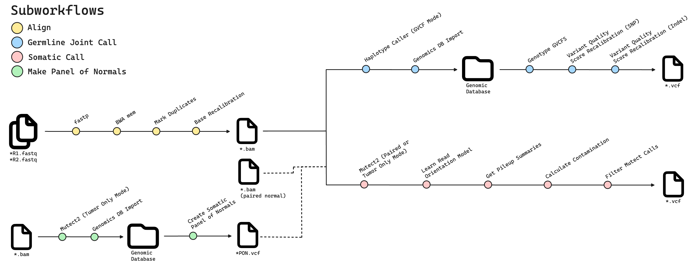

# Nextflow Workflows

Data workflows for germline joint variant calling, somatic tumor-only and tumor-normal variant calling, and panel of normals creation.

## Overview

This pipeline is designed to run germline joint variant calling and somatic variant calling from either `*.fastq` or `*.bam` input files using GATK best practices.
It was developed to handle a variety of common workflow considerations, such as custom intervals for WES/WGS, inclusion of paired normals, creation of a panel of
normals, and quality control reporting and metrics. The main subworkflows can be seen in the diagram below.



## Getting Started

To run these workflows, you will need to install [Nextflow](https://github.com/nextflow-io/nextflow) (23.04.3) and [Singularity](https://github.com/sylabs/singularity) (3.8.7)
on an x86_64 machine. On the first run, a Docker image will be pulled to create a Singularity container with all of the required software for the workflow.

There are also a few different reference files which are needed to run this pipeline. The names of these specific files can be found in the `nextflow.config` file. Before you run your workflows, be sure that you have all of these required reference files in the directories defined in `nextflow.config`. You can find these these files in the following GATK resource buckets:

- [Genomics Public Data Bucket](https://console.cloud.google.com/storage/browser/genomics-public-data/resources/broad/hg38/v0)
- [GATK Best Practices Bucket](https://console.cloud.google.com/storage/browser/gatk-best-practices/somatic-hg38)


```text
  ____    _    ____                               
 / ___|  / \  |  _ \                              
| |  _  / _ \ | |_) |                             
| |_| |/ ___ \|  __/                              
_\____/_/ __\_\_|    _     __ _                   
\ \      / /__  _ __| | __/ _| | _____      _____ 
 \ \ /\ / / _ \| '__| |/ / |_| |/ _ \ \ /\ / / __|
  \ V  V / (_) | |  |   <|  _| | (_) \ V  V /\__ \
   \_/\_/ \___/|_|  |_|\_\_| |_|\___/ \_/\_/ |___/

Samples:          null
Reference Genome: ${PWD}/reference/Homo_sapiens_assembly38.fasta

S U B W O R K F L O W   O P T I O N S
=====================================
--input=null
  <string> input file type (options: fastq, bam)

--subworkflow=null
  <string> subworkflow (options: joint-call, somatic-call, make-pon)

--out=OUT
  <string> name of outputs directory

--pon=null
  <string> path to panel of normals; used in somatic-call subworkflow

--gendb=GENDB
  <string> name of new genomics database; used in joint-call and make-pon subworkflow

--updategendb=null
  <string> path to existing genomics database; used when adding a new sample to genomicsdb in joint-call or make-pon subworkflow

--paired=false
  <boolean> determines if somatic-caller subworkflow is run with a paired normal
```

## Example Usage

### Sample Sheet Format

All subworkflows require a sample sheet, which is a headerless *csv* with either two or three columns.
Generally, each row provides a sample identifier and paths to fastq/bam files for the corresponding sample.
If starting from paired-end short read `*.fastq` inputs:

```text
sample01,/absolute/path/to/sample01-R1.fastq.gz,/absolute/path/to/sample01-R2.fastq.gz
sample02,/absolute/path/to/sample02-R1.fastq.gz,/absolute/path/to/sample02-R2.fastq.gz
sample03,/absolute/path/to/sample03-R1.fastq.gz,/absolute/path/to/sample03-R2.fastq.gz
```

If you are starting from aligned, analysis-ready `*.bam` files:

```text
sample01,/absolute/path/to/sample01.bam
sample02,/absolute/path/to/sample02.bam
sample03,/absolute/path/to/sample03.bam
```

Alternatively, if you want to run the somatic call workflow with a paired normal, you must use a three-columns sample sheet, where the second and third columns are paths to the 
tumor and normal `*.bam` files, respectively.

```text
sample01,/absolute/path/to/sample01-tumor.bam,/absolute/path/to/sample01-normal.bam
sample02,/absolute/path/to/sample02-tumor.bam,/absolute/path/to/sample02-normal.bam
sample03,/absolute/path/to/sample03-tumor.bam,/absolute/path/to/sample03-normal.bam
```

### FASTQ Inputs

```bash
# FASTQ to BAM
nextflow run --input fastq --samples /path/to/sample-sheet.csv main.nf

# FASTQ to Germline Cohort VCF
nextflow run --input fastq \
  --subworkflow joint-call \
  --samples /path/to/sample-sheet.csv \
  main.nf

# FASTQ to Tumor-Only VCF
nextflow run --input fastq \
  --subworkflow somatic-call \
  --samples /path/to/sample-sheet.csv \
  main.nf

```

### BAM Inputs

```bash
# BAM to Germline Cohort VCF
nextflow run --input bam \
  --subworkflow joint-call \
  --samples /path/to/sample-sheet.csv \
  main.nf

# BAM to Tumor-Only VCF
nextflow run --input bam \
  --subworkflow somatic-call \
  --samples /path/to/sample-sheet.csv \
  main.nf

# BAM to Tumor-Normal VCF
nextflow run --input bam \
  --paired \
  --subworkflow somatic-call \
  --samples /path/to/sample-sheet.csv \
  main.nf
```

### Updating an Existing Genomics Database

If you want to use an existing genomics database for new samples, provide the *absolute* path to the genomics database using the `--updategendb` parameter.
NB: the name of all genomics database directories is set as `GENDB`, but you can change this using the `--gendb` parameter. Below is an example of
adding new `*.fastq` samples to an existing genomics database and joint-calling the updated cohort.

```text
nextflow run \
  --input fastq \
  --subworkflow joint-call \
  --samples /path/to/sample-sheet.csv \
  --updategendb /absolute/path/to/genomics-databse \
  main.nf
```

## Outputs

The output folder has a default folder name `OUT`, however it can be renamed with the `--out` parameter. The exact contents of `OUT` will depend on your subworkflow.

```text
OUT/
├─ bams/
│  ├─ <sample01>-markdup-bqsr.bam
│  ├─ <sample02>-markdup-bqsr.bam
│  ├─ ...
├─ gvcfs/
│  ├─ <sample02>.g.vcf.gz
│  ├─ <sample01>.g.vcf.gz
│  ├─ ...
├─ <genomicsdb_name>/
├─ cohort-vcfs/
│  ├─ cohort-<genomicsdb_name>.vcf.gz
│  ├─ cohort-<genomicsdb_name>-snp-recal.vcf.gz
│  ├─ cohort-<genomicsdb_name>-snp-indel-recal.vcf.gz
├─ pon/
│  ├─ pon-<genomicsdb_name>.vcf.gz
├─ mutect2/
│  ├─ filtered/
│  │  ├─ <sample01>-mutect2-filtered.vcf.gz
│  │  ├─ ...
│  ├─ unfiltered/
│  │  ├─ <sample01>-mutect2.vcf.gz
│  │  ├─ ...
├─ reports/
│  ├─ <tool-name>-<sample01>.html
│  ├─ <tool-name>-<sample02>.html
│  ├─ ...
├─ logs/
│  ├─ <tool_name>-<sample01>.log
│  ├─ <tool_name>-<sample02>.log
│  ├─ ...
```
